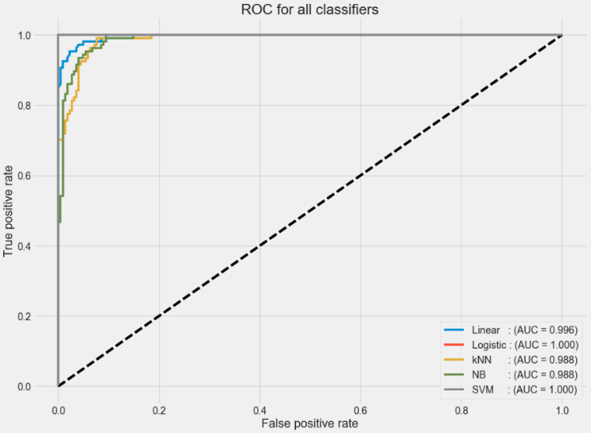
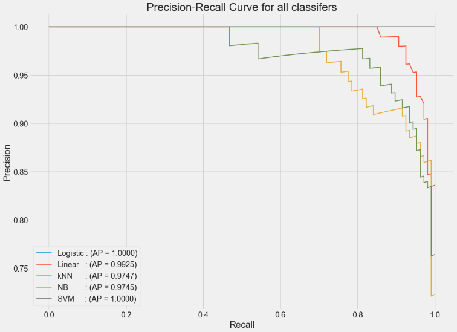

# ASD-Detection
Detecting Austism SPectrum Disorder(ASD) in Adults and Children 

## Overview 
- In this project, I have built and compared several classifiers to help with the diagnosis of ASD
using the ASD Screening Data for Adults and Children datasets.
- These classifiers could be useful for proposing possible new methods of ASD screening, which should
be time-efficient and accessible to help health professionals and inform individuals whether
they should pursue formal clinical diagnosis. 

## Dataset
- Autistic Spectrum Disorder Screening Data for Adults and Children from UCI repo
- Data set includes 20 features of which 10 are demographic information and 10 are bahavior features from a questionaire
- [Children](https://archive.ics.uci.edu/ml/datasets/Autistic+Spectrum+Disorder+Screening+Data+for+Children++), [Adults](https://archive.ics.uci.edu/ml/datasets/Autism+Screening+Adult)

## Models 
- linear regression
- logistic regression
- Naive Bayes
- k Nearest Neighbor(kNN)
- Support Vector Machine(SVM)

## Results 
- Comparing all the classifiers, Logistic regression and SVM have the best performance
- Linear Regression, KNN and Naïve Bayes have their shortcomings

        
